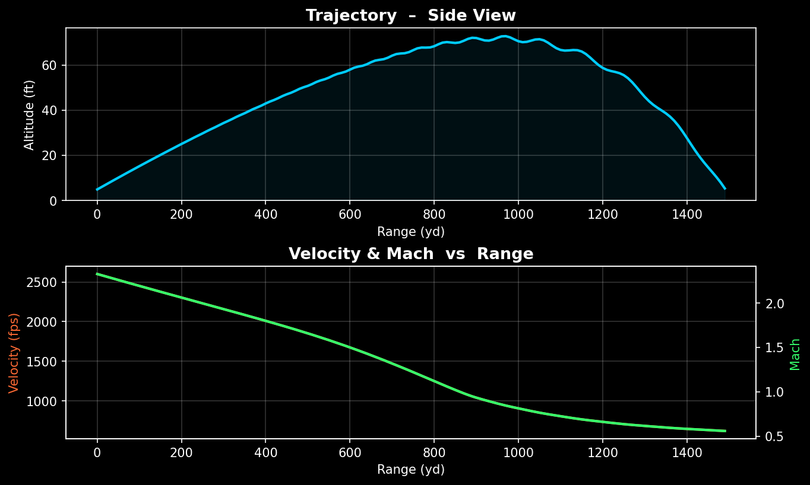
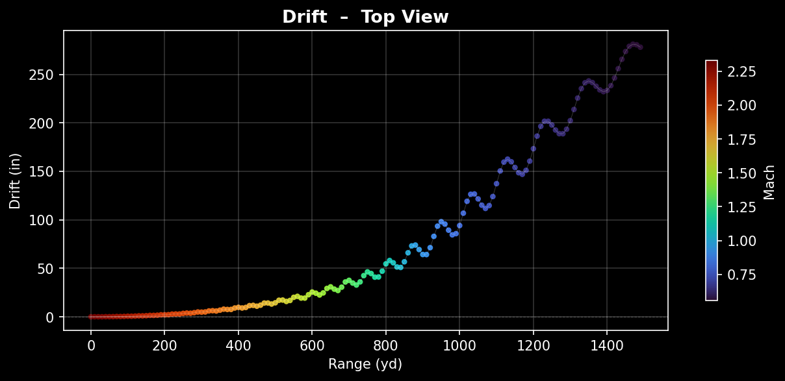
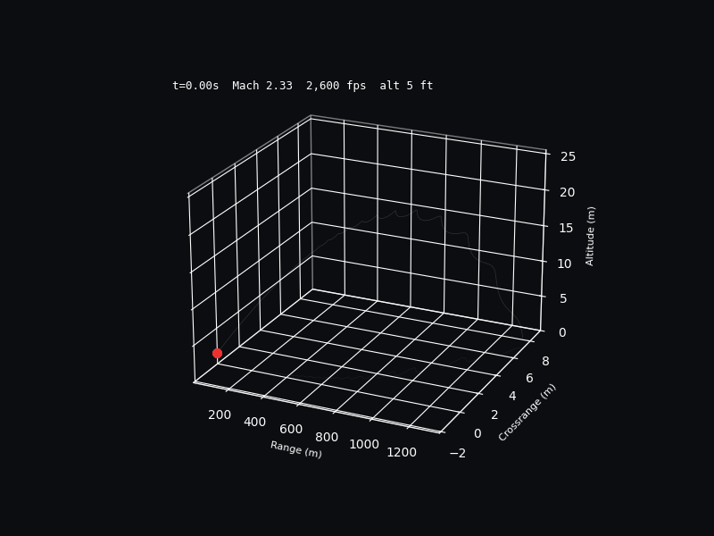
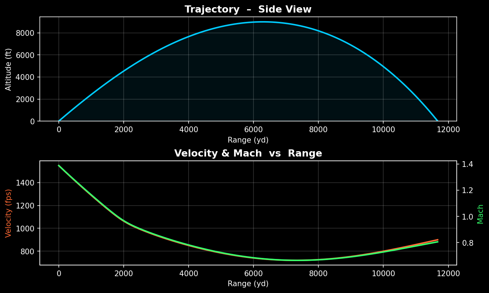
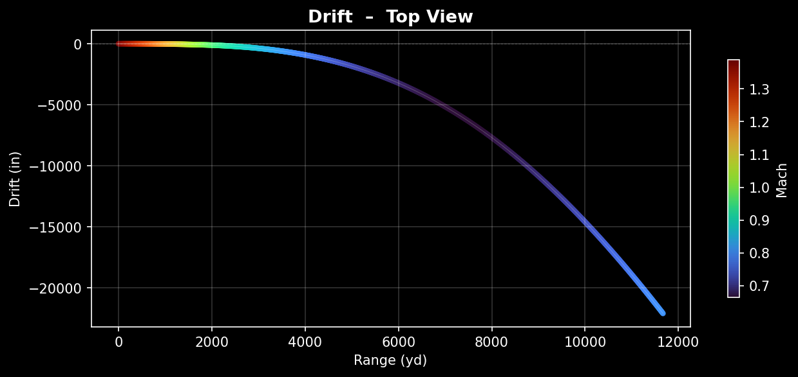
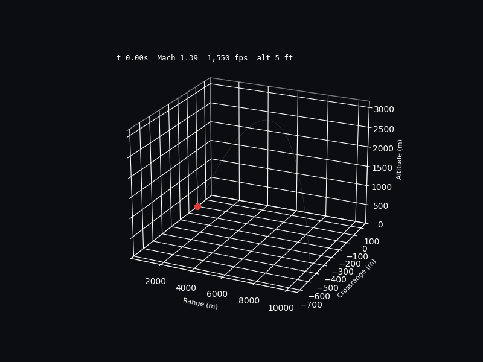

# Ballistic 6-DOF Flight Simulator

A rigid-body **six-degree-of-freedom** ballistic flight simulator written in C++17 with Eigen, featuring interactive Python/Matplotlib visualization and 3D animation.

The simulator models a spinning projectile subject to gravity, aerodynamic drag (Mach-dependent), Magnus effect, gyroscopic moments, Coriolis acceleration, and 3-axis wind — all integrated with a 4th-order Runge-Kutta solver at a 50 &mu;s timestep.

---

## Features

- **Full 6-DOF dynamics**  quaternion orientation, spin, precession, and nutation
- **Mach-dependent drag**  interpolated Cd table across subsonic, transonic, and supersonic regimes
- **Coriolis effect**  latitude-dependent Earth rotation coupling
- **3-axis wind**  headwind, crosswind, and vertical wind components
- **Gyroscopic stability**  spin-dependent Magnus force and pitch damping
- **Interactive 2D plots**  side view (trajectory + velocity) and top view (drift)
- **Interactive 3D animation**  real-time bullet model with orientation, Mach-colored trail, telemetry HUD, playback controls, and zoom

---

## Requirements

| Component | Version |
|-----------|---------|
| C++ compiler | C++17 (tested with MinGW/GCC) |
| CMake | 3.10+ |
| Eigen | 5.0 |
| Python | 3.10+ |
| matplotlib | 3.10+ |
| numpy | latest |

---

## Building

```bash
cd ballistic6dof/build
cmake .. -G "MinGW Makefiles"
cmake --build .
```

---

## Usage

The simulator reads all parameters from a **config file**:

```bash
./ballistic6dof.exe ../configs/default.cfg
```

This will:
1. Load the config and print the parameters
2. Run the 6-DOF simulation
3. Write a text report and CSV to the config file's directory
4. Launch the interactive 2D plot windows
5. Launch the interactive 3D animation

### Pre-made configs

| Config | Round | Range |
|--------|-------|-------|
| `default.cfg` | .308 Win 150gr | 1,000 m |
| `308_long_range.cfg` | .308 Win 175gr SMK | 1,500 yd |
| `308_windy.cfg` | .308 Win 175gr (20 mph crosswind) | 1,000 yd |
| `556_nato.cfg` | 5.56 NATO 62gr M855 | 600 m |
| `762_soviet.cfg` | 7.62x39 123gr FMJ | 500 m |
| `6.5_creedmoor.cfg` | 6.5 CM 140gr ELD Match | 1,500 m |
| `300_winmag.cfg` | .300 Win Mag 190gr SMK | 1,500 m |
| `338_lapua.cfg` | .338 Lapua 250gr SMK | 2,000 m |
| `50bmg.cfg` | .50 BMG 647gr M33 Ball | 2,500 m |
| `9mm_pistol.cfg` | 9mm Luger 124gr FMJ | 200 m |
| `45acp.cfg` | .45 ACP 230gr FMJ | 150 m |
| `howitzer_105mm.cfg` | 105mm M1 HE shell | 12,000 m |

---

## Configuration Reference

Config files use a simple `key = value` format. Lines starting with `#` are comments. Any missing key uses the built-in default.

```ini
# --- Projectile ---
mass_gr           = 150.0       # bullet mass in grains
caliber_in        = 0.308       # bullet diameter in inches
length_in         = 1.12        # bullet length in inches

# --- Launch ---
muzzle_velocity_fps = 2750.0    # muzzle velocity in feet per second
twist_rate          = 12.0      # barrel twist rate in inches per turn
elevation_deg       = 0.5       # launch elevation in degrees
azimuth_deg         = 0.0       # launch azimuth in degrees (0 = north)

# --- Environment ---
latitude_deg      = 45.0        # shooter latitude (for coriolis)
headwind          = 0.0         # headwind in m/s (positive = into shooter)
crosswind         = 0.0         # crosswind in m/s (positive = left to right)
vertical_wind     = 0.0         # vertical wind in m/s (positive = upward)

# --- Simulation ---
max_range_m       = 1000.0      # stop simulation at this range in meters
timestep_us       = 50.0        # integration timestep in microseconds
```

---

## Demos

### Unstable .308 Caliber
This particular bullet was configured incorrectly, but I feel that it is a good example of how poorly designed projectiles are simulted in this environment. WHen entering the trans-sonic region, trans-sonic instabillity is induced and the bullet starts to oscillate towards the end of the simulation.

**Side View — Trajectory & Velocity**



**Top View — Wind Drift**



**3D Trajectory Animation**



---


### 105mm Howitzer — Artillery (15 kg HE shell, 40° elevation)

**Side View — Trajectory & Velocity**



**Top View — Drift**



**3D Trajectory Animation**



---

## 3D Animation Controls

| Input | Action |
|-------|--------|
| Mouse drag | Orbit camera around projectile |
| Scroll wheel | Zoom in / out |
| Space | Pause / Resume |
| Up / Right / + | Speed up (2x) |
| Down / Left / - | Slow down (0.5x) |
| T | Toggle Mach-colored trail |
| G | Toggle ghost trajectory |
| R | Reset & rewind to start |
| Q / Escape | Quit |

The animation also includes a **Play/Pause button**, **time scrub slider**, and **speed multiplier slider** in the right panel.

---

## Output Files

Each simulation run produces two files in the same directory as the config:

- **`ballistic_report.txt`** — human-readable summary (muzzle conditions, time of flight, apogee, impact velocity)
- **`ballistic_trajectory.csv`** — full trajectory data at ~10 yard intervals with columns: `time, range, crossrange, altitude, velocity, mach, spin_rpm, pitch, yaw, roll, alpha, beta`

---

## Project Structure

```
ballistic6dof/
  CMakeLists.txt
  README.md
  configs/            # simulation config files
  docs/               # demo images
  src/
    main.cpp          # config parser + entry point
    solver.cpp        # 6-DOF RK4 integrator
    atmosphere.cpp    # ISA standard atmosphere model
    aero.cpp          # drag lookup + default aero coefficients
    projectile.cpp    # mass properties + moments of inertia
    report.cpp        # text report + CSV output
  include/
    solver.hpp
    state.hpp         # state vector + quaternion utilities
    flight_record.hpp
    projectile.hpp
    atmosphere.hpp
    aero.hpp
    constants.hpp
  plot/
    plot_trajectory.py   # interactive 2D plots
    animate_3d.py        # interactive 3D animation
    generate_demo.py     # static image + GIF generator
  build/
```
